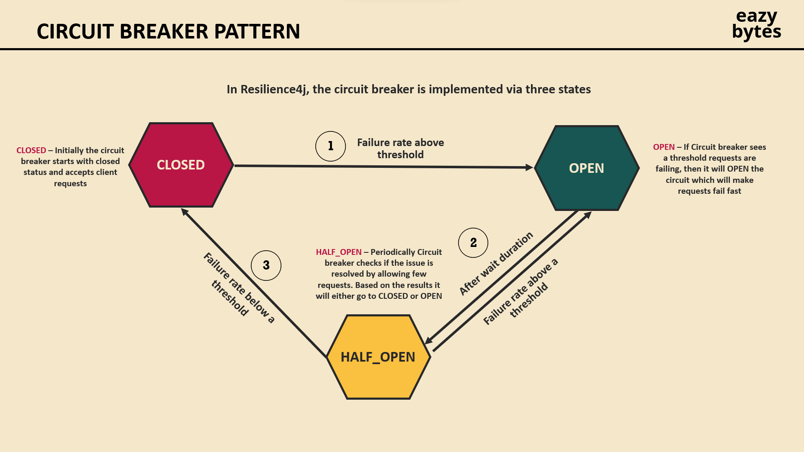
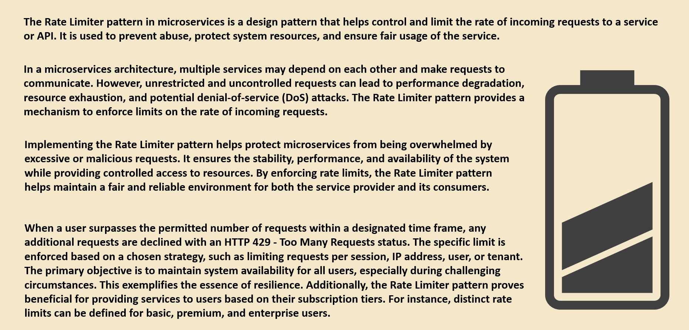
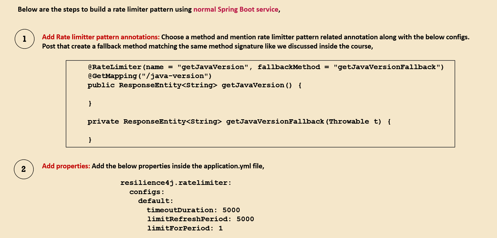

# Microservices with Resilience4j

## 1. Circuit Breaker with Resilience4j
A circuit breaker is a design pattern used to handle failures gracefully in distributed systems. 
It prevents a service from making repeated requests to an unresponsive or slow service, thereby protecting the system from cascading failures.

> agar ye example na smjh aaye to niche author ,book wala example hai wo dekho aur feel lo,yha se bas ye pom.xml delh lo what dependency is required



## <span style="color:pink">How it Works?</span>

## Example Scenario
We have three microservices:

### User Service: ( we will implement here the ckt breaker )
Exposes an API to get user details and enriches it with ratings and hotel information.

### Rating Service:
Provides ratings data (rating, userId, hotelId).

### Hotel Service:
Provides hotel details based on hotelId.
The flow:

### How Circuit Breaker Works

**User Service calls:**
- Rating Service to fetch ratings for a user.
- Hotel Service to fetch hotel details for each rating.

**Ckt Breaker**
- If Rating Service or Hotel Service is down or slow:
- The circuit breaker trips and prevents further calls for a certain period.
- A fallback method is executed to return default or cached data.
- The circuit breaker uses Resilience4j for implementation.


## <span style="color:pink">Implementation of Ckt breaker pattern </span>

User Service
**Controller Code**
```
@RestController
@RequestMapping("/users")
public class UserController {

    @Autowired
    private UserService userService;

    @GetMapping("/{userId}")
    public ResponseEntity<User> getUserWithDetails(@PathVariable String userId) {
        User user = userService.getUserWithDetails(userId);
        return ResponseEntity.ok(user);
    }
}
```

**Step 1 :** add the dependency and the application.properties in the user service
```
pom.xml

<dependency>
    <groupId>io.github.resilience4j</groupId>
    <artifactId>resilience4j-spring-boot2</artifactId>
</dependency>

// optional
<dependency>
    <groupId>org.springframework.boot</groupId>
    <artifactId>spring-boot-starter-actuator</artifactId>
</dependency>

Circuit breaker health is exposed at: http://localhost:8081/actuator/health.


application.properties

server.port=8081
spring.application.name=USER-SERVICE
eureka.client.service-url.defaultZone=http://localhost:8761/eureka

# Resilience4j configuration
resilience4j.circuitbreaker.instances.ratingService.registerHealthIndicator=true
management.endpoints.web.exposure.include=health,metrics

make sure to use the same name ,  here (ratingService) is used


or , some more ckt breaker extensive properteis used here in tranasaction service

# ********** for circuit breakers ***********************
#Resilinece4j circuitbreaker Properties
resilience4j.circuitbreaker.instances.asset-management.registerHealthIndicator=true
resilience4j.circuitbreaker.instances.asset-management.event-consumer-buffer-size=10

### this tells the ckt breaker to send 5 req to the half open ckt and check if it is working
resilience4j.circuitbreaker.instances.asset-management.slidingWindowType=COUNT_BASED
resilience4j.circuitbreaker.instances.asset-management.slidingWindowSize=5

### this tells that if the 50% of the traffic you sending is able to get processed make the half open to closed
resilience4j.circuitbreaker.instances.asset-management.failureRateThreshold=50

### some more props
resilience4j.circuitbreaker.instances.asset-management.waitDurationInOpenState=5s
resilience4j.circuitbreaker.instances.asset-management.permittedNumberOfCallsInHalfOpenState=3
resilience4j.circuitbreaker.instances.asset-management.automaticTransitionFromOpenToHalfOpenEnabled=true

```
**Step 2 :**  use ` @CircuitBreaker(name = "ratingService", fallbackMethod = "fallbackForRatings")` + define a fallback method

**falllback method :** It is executed when the ckt is entirely open . Make sure to use the same function signature as of the main method here

User Service **service code**
``` 
@Service
public class UserService {

    @Autowired
    private RestTemplate restTemplate;

    @CircuitBreaker(name = "ratingService", fallbackMethod = "fallbackForRatings")
    public User getUserWithDetails(String userId) {
        // Fetch user details (mocked here)
        User user = new User(userId, "John Doe");

        // Call Rating Service
        Rating[] ratings = restTemplate.getForObject("http://RATING-SERVICE/ratings/users/" + userId, Rating[].class);
        user.setRatings(Arrays.asList(ratings));

        // Fetch hotel details for each rating
        user.getRatings().forEach(rating -> {
            Hotel hotel = restTemplate.getForObject("http://HOTEL-SERVICE/hotels/" + rating.getHotelId(), Hotel.class);
            rating.setHotel(hotel);
        });

        return user;
    }

    // Fallback method
    public User fallbackForRatings(String userId, Throwable throwable) {
        User user = new User(userId, "John Doe");
        user.setRatings(Collections.emptyList()); // Return empty ratings
        return user;
    }
}
```

Other services in which the **user service** are dependent

```
Rating Service
Controller Code

@RestController
@RequestMapping("/ratings")
public class RatingController {

    @GetMapping("/users/{userId}")
    public List<Rating> getRatingsByUserId(@PathVariable String userId) {
        return List.of(
            new Rating(userId, "H1", 5),
            new Rating(userId, "H2", 4)
        );
    }
}


```
````
application.properties

server.port=8082
spring.application.name=RATING-SERVICE
eureka.client.service-url.defaultZone=http://localhost:8761/eureka


````


```
Hotel Service
Controller Code

@RestController
@RequestMapping("/hotels")
public class HotelController {

    @GetMapping("/{hotelId}")
    public Hotel getHotelById(@PathVariable String hotelId) {
        return new Hotel(hotelId, "Hotel " + hotelId, "City Center");
    }
}
application.properties

server.port=8083
spring.application.name=HOTEL-SERVICE
eureka.client.service-url.defaultZone=http://localhost:8761/eureka

```


```
server.port=8080
spring.application.name=API-GATEWAY
eureka.client.service-url.defaultZone=http://localhost:8761/eureka

spring.cloud.gateway.routes[0].id=USER-SERVICE
spring.cloud.gateway.routes[0].uri=lb://USER-SERVICE
spring.cloud.gateway.routes[0].predicates[0]=Path=/users/**

spring.cloud.gateway.routes[1].id=RATING-SERVICE
spring.cloud.gateway.routes[1].uri=lb://RATING-SERVICE
spring.cloud.gateway.routes[1].predicates[0]=Path=/ratings/**

spring.cloud.gateway.routes[2].id=HOTEL-SERVICE
spring.cloud.gateway.routes[2].uri=lb://HOTEL-SERVICE
spring.cloud.gateway.routes[2].predicates[0]=Path=/hotels/**

```


## 2. Retry Pattern with Resilience4j
The retry pattern will make multiple retry attempts when a servcice has temporary failed and it will retry to revice that service

## <span style="color:pink">How it Works?</span>


## <span style="color:pink">Implementation of Retry pattern </span>

**Step 1 :** add the dependency and the application.properties in the user service
```
pom.xml

<dependency>
    <groupId>io.github.resilience4j</groupId>
    <artifactId>resilience4j-spring-boot2</artifactId>
</dependency>

// optional
<dependency>
    <groupId>org.springframework.boot</groupId>
    <artifactId>spring-boot-starter-actuator</artifactId>
</dependency>

Circuit breaker health is exposed at: http://localhost:8081/actuator/health.


application.properties

server.port=8081
spring.application.name=USER-SERVICE
eureka.client.service-url.defaultZone=http://localhost:8761/eureka

#Resilience4J Timeout And Retry Properties
resilience4j.timelimiter.instances.ratingService.timeout-duration=10s
resilience4j.retry.instances.ratingService.max-attempts=3
resilience4j.retry.instances.ratingService.wait-duration=5s

make sure to use the same name ,  here (ratingService) is used

```

**Step 2 :**  use ` @Retry(name = "ratingService", fallbackMethod = "fallbackForRatings")` + define a fallback method

**falllback method :** It is executed when the service is not avaliable eve after certain no of retries . Make sure to use the same function signature as of the main method here

User Service **service code**
``` 
@Service
public class UserService {

    @Autowired
    private RestTemplate restTemplate;

    @Retry(name = "ratingService", fallbackMethod = "fallbackForRatings")
    public User getUserWithDetails(String userId) {
        // Fetch user details (mocked here)
        User user = new User(userId, "John Doe");

        // Call Rating Service
        Rating[] ratings = restTemplate.getForObject("http://RATING-SERVICE/ratings/users/" + userId, Rating[].class);
        user.setRatings(Arrays.asList(ratings));

        // Fetch hotel details for each rating
        user.getRatings().forEach(rating -> {
            Hotel hotel = restTemplate.getForObject("http://HOTEL-SERVICE/hotels/" + rating.getHotelId(), Hotel.class);
            rating.setHotel(hotel);
        });

        return user;
    }

    // Fallback method
    public User fallbackForRatings(String userId, Throwable throwable) {
        User user = new User(userId, "John Doe");
        user.setRatings(Collections.emptyList()); // Return empty ratings
        return user;
    }
}
```

## 3. Rate Limiter Pattern with Resilience4j

## <span style="color:pink">How it Works?</span>


We might have a service which can handle only a
certain number of requests in given time
RateLimiter module allows us to enforce
restrictions and protect our services from too many
requests

## <span style="color:pink">Implementation of Rate Limiter pattern </span>


```dockerfile
# ************ rate limiter mechanism ********************************
resilience4j.ratelimiter.instances.transactionBreaker.timeout-duration = 2
# it will allow 2 calls for every 4s
resilience4j.ratelimiter.instances.transactionBreaker.limit-refresh-period = 4s
resilience4j.ratelimiter.instances.transactionBreaker.limit-for-period = 2
```


