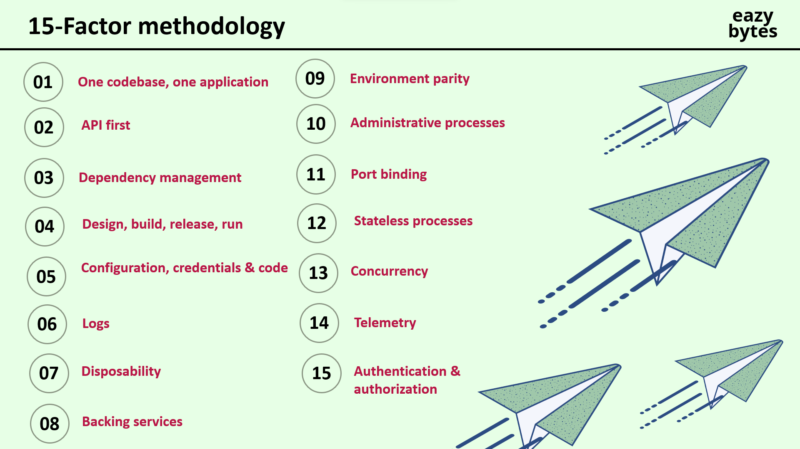
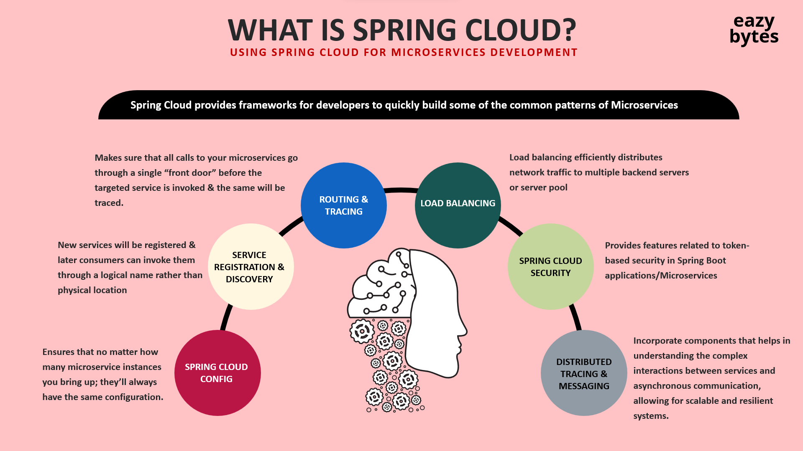
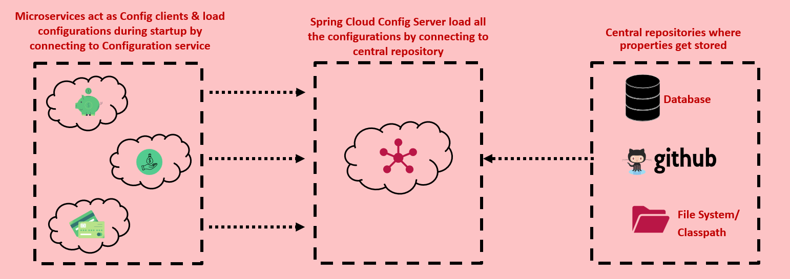
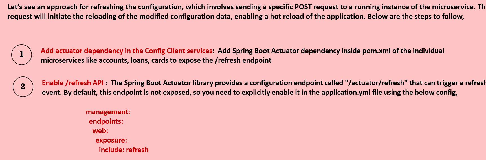

> [!NOTE]
> Useful information that users should know, even when skimming content.
Before building Microservice your microservice must adher these 15 factors
# Microservices in Springboot



### So if you are building a Microservice then first run the Eureka , API gateway and the Config Server
- lets start with the first these 3 servers
- we use `Spring Cloud` to build microservice in springboot . 


## 1. Config Server
- We already now how we can set configs for a springboot app using profiles . They are tightly coupled with the app
- In microservices , we need to externalize the configs to a config server so that the changes in the configs are quickly reflected
- particularly useful when multiple services share common configurations. It provides a centralized way to manage and distribute configuration properties, ensuring consistency and reducing duplication across services.

> Config Server is a centralized server that manages externalized configuration for distributed systems. It allows you to keep the configuration for all your microservices in a single location, making it easier to manage and update configurations across multiple services.

- Every microservice on start up fetches there configuration from the config server
- We use `Spring Cloud Config` is a popular implementation that integrates well with Spring Boot applications. It can fetch configurations from various sources like Git, file systems, or databases.

## <span style="color:pink">How it Works?</span>

### Config Server:
Reads configuration files from a specified source (e.g., Git).
Serves these configurations to client applications. Config Server fetches the configuration file corresponding to the active profile.

### Client Applications:
Fetch configurations from the Config Server at startup runtime.
Use the configurations to set up their environment.



## <span style="color:pink">Setting Up a Config Server</span>
### Steps
- It wil have 2 parts : Config server and the Config server clients ( other microservices + eureka & except api gateway )
1. Create a new spring config server project and add the `@EnableConfigServer` annotation to the config server main application class:

2. **How to set up the config server ?**  
Add the spring cloud + spring config server dependencies to the pom.xml:
```
<!-- cloud dependency common to all micro services + config server + api gateway + eureka -->
    <properties>
		<java.version>17</java.version>
		<spring-cloud.version>2023.0.2</spring-cloud.version>
	</properties>

	<dependencyManagement>
		<dependencies>
			<dependency>
				<groupId>org.springframework.cloud</groupId>
				<artifactId>spring-cloud-dependencies</artifactId>
				<version>${spring-cloud.version}</version>
				<type>pom</type>
				<scope>import</scope>
			</dependency>
		</dependencies>
	</dependencyManagement>
	
```

3. **How to set up the config server client ?**
   Add the `spring-cloud-config-server` dependencies to the pom.xml then configure the application.properties file for the `Config Server` project:
```
<dependency>
<groupId>org.springframework.cloud</groupId>
<artifactId>spring-cloud-config-server</artifactId>
</dependency>

application.properties for storing the configs in github

server.port=8888
spring.application.name=config-server

spring.profiles.active=git
spring.cloud.config.server.prefix=/config-server

spring.cloud.config.server.git.uri=https:#github.com/your-repo/config-repo.git
spring.cloud.config.server.git.clone-on-start=true

Create a Git repository (e.g., https:#github.com/your-repo/config-repo) to store configuration files. Add files for each microservice and environment:

inside : 

config-repo/
├── service-a.properties
├── service-a-dev.properties
├── service-b.properties
├── service-b-prod.properties

# -----------------------------------------------------------------------------------------------


application.properties storing the configs in local file system

server.port=8888
spring.application.name=config-server

# Enable native profile (default) to read local files , we can select profile in the respective service application.properties
spring.profiles.active=native
spring.cloud.config.server.prefix=/config-server

# Absolute path to the config files folder , no quotes "" . in MAC quote required
#spring.cloud.config.server.native.searchLocations=file:///E:/Java_Backend_Git/royal-reserve-bank/config-files

# relative path to the config files folder , no quotes "" . in MAC quote required
spring.cloud.config.server.native.searchLocations=file:../config-files

Create a confif-files folder like below

config-files/
├── service-a.properties
├── service-a-dev.properties
├── service-b.properties
├── service-b-prod.properties
config-server/
src/java bla bla

```

4. To all the Client applications which wants to access the configs from config server.
Add `spring-cloud-config-client` dependencies to the client application pom.xml:
```
<dependency>
    <groupId>org.springframework.cloud</groupId>
    <artifactId>spring-cloud-config-client</artifactId>
</dependency>

note : `spring-cloud-starter-config` used to be common in older versions of spring
```
and Configure the `application.properties` file for the client applications so that they could connect to the config server

```
spring.application.name=account-api   # this has to be same as the filename e.g account-api.properties
spring.config.import=configserver:
# configserver:  is a keyword not the config server project name , keep as it is

spring.cloud.config.uri=http:#localhost:8888/config-server

you can activte the profiles , if you dont actiate then teh default one will be taen
spring.profiles.activate=docker

```

| You are building a...                                            | Use this dependency            |
| ---------------------------------------------------------------- | ------------------------------ |
| **Config Client** (a service fetching config from Config Server) | ✅ `spring-cloud-config-client` |
| **Config Server** (central config provider)                      | ✅ `spring-cloud-config-server` |

5. On successfull config server set up you can view the configs by GET request to the url `http:#localhost:8888/config-server/account-api/docker(or default)`
it will show the configs of the particular .properties file

> [!NOTE]
> 
>Q How through the config server uri , the microservice project it gets to pull the config files ?
> 
> ans: Each service specifies its application name in its application.properties right so wha se service ka naam pata hota
aur us service ke naam se git pe application.properties hoga or inside the config folder (see service-name.properties file is there) usse wo fetch ho jayega and we can give teh rofile name too
>
> Q I want to load config changes dynamically in the running microservice
> 
> 

<hr/>

# 2. Eureka

- Eureka Server is a service registry that plays a central role in the automatic detection of new services on a network. 
- It acts as the heart of your microservices ecosystem, allowing service instances to register themselves and facilitating service discovery. 
- Key aspects of Eureka Server include:


    Client Registration: Instances of microservices automatically register themselves with Eureka Server.
    Service Discovery: Eureka Server maintains a registry of all client applications running on different ports and IP addresses.

> [!NOTE]
>
>Q What is the use of the Eureka server
>
> ans : The load balancer checks the healthy clients available , if there were not discovery server than the IPs have to be 
> manually updated to the load balancer to forward the incoming requests
>

## <span style="color:pink">Setting Up a Eureka Server and Register the services</span>
### Steps
- It wil have 2 parts : Eureka server and the Eureka clients ( other microservices + api gateway + config server )
1. Go to Spring initializer website create project (eureka server) & in main class you have to add `@EnableEurekaServer` annotation to make the project work as a eureka or discovery server
2. **How to set up the eureka server ?**  
In the `Eureka server` project add `spring-cloud-starter-netflix-eureka-server` dependency and add the following application.properties
```dockerfile
       <dependency>
            <groupId>org.springframework.cloud</groupId>
            <artifactId>spring-cloud-starter-netflix-eureka-server</artifactId>
        </dependency>
        
        
in application.properties of the eureka server 

server.port=8761
spring.application.name=eureka-server

# eureka server related properties

# Ensures the application uses its IP address instead of hostname when registering.
eureka.instance.prefer-ip-address=true


# this is the eureka server url that the eureka clients ( other microservices )
# will use to connect and see the registries in the dashboard along with the above credentials
# like this : eureka.client.serviceUrl.defaultZone=http:#eureka:password@localhost:8761/eureka

# credentials
spring.security.user.name=eureka
spring.security.user.password=password
eureka.instance.hostname=localhost

eureka.client.serviceUrl.defaultZone=http:#localhost:8761/eureka

# Eureka-specific configs for Eureka Server , I have commented to make sure this eureks server is not included in eureka dashboard
# and has nothing to fetch ad see the registries in the dashboard

#eureka.client.register-with-eureka=false
#eureka.client.fetch-registry=false

```
do these things and run application ,your erureka server is ready for registering clinet

3. **How to set up the eureka clients ?**

In the `Eureka server` project add `spring-cloud-starter-netflix-eureka-client` dependency and add the following application.properties

```dockerfile
<dependency>
<groupId>org.springframework.cloud</groupId>
<artifactId>spring-cloud-starter-netflix-eureka-client</artifactId>
</dependency>

in application.properties of the eureka clients

so if you see these properties will be same for every services or clients ,each will register themselves on eureka

 spring.application.name=eureka-client-a            # Name of your client application
 server.port=8081                                   # Port on which this client runs


# this is the eureka server url that the eureka clients ( other microservices )
# will use to connect and see the registries in the dashboard along with the above credentials

  eureka.client.serviceUrl.defaultZone=http:#eureka:password@localhost:8761/eureka  # URL of the Eureka server
  
  
# Eureka-specific configs for Eureka Clients , to make sure this client is included in eureka dashboard

  eureka.client.register-with-eureka=true                             # Register this client with Eureka (default: true)
  eureka.client.fetch-registry=true                                   fetch-registry property controls whether the client fetches the registry of other services from the Eureka server

```

| You are building a...                                                | Use this dependency            |
|----------------------------------------------------------------------| ------------------------------ |
| **Eureka Client** (a service that want to register in eureka server) | ✅ `spring-cloud-starter-netflix-eureka-client` |
| **Eureka Server** (central eureka server)                            | ✅ `spring-cloud-starter-netflix-eureka-server` |

4. On successfully `eureka server` set up you can view the registered clients by GET request to the url `http:#localhost:8761`
   it will show all the registered clients ( microservices )

<hr/>

## <span style="color:pink">Lets understand how 2 service A and B communicate Synchronously</span>
lets understand with example ,
**let say you have two spring projects A and B and B wants to call api from A service
how this will happen?**

**Answer:** Here comes Eureka
There are 3  between two services(two spring projects)

now once these things are done you want to call api of project A from project B

**how to do that?**

Service A: Controller that exposes an endpoint and this endpoint has to be called from B
```dockerfile


@RestController
public class ServiceBController {

    @GetMapping("/{userId}/message")
    public String getMessage( @PathVariable("userId") String userId ) {
        return "Hello from Service B!";
    }
}
```

Now in Service B

#### Method 1 : RestTemplate (Deprecated but still used)

```dockerfile

# Register a bean for the RestTemplate in AppConfig.java

@Bean
public RestTemplate restTemplate() {
    return new RestTemplate();
}

# Now use that restTemplate to fetch the url
@Service
public class OrderClient {

    private final RestTemplate restTemplate;

    @Autowired
    public OrderClient(RestTemplateBuilder builder) {
        this.restTemplate = builder.build();
    }

    public List<String> getUserOrders(String userId) {
        String url = "http:#localhost:8081/{userId}/message" + userId;
        ResponseEntity<String> response = restTemplate.getForEntity(url, String.class);
        
        # if the resp is List and all
        # ResponseEntity<List> response = restTemplate.getForEntity(url, List.class);
        
        return response.getBody();
    }
}

```

Since Rest Template is depricated There is a Rest Client in use now

#### Method 2 : WebClient (Modern & Recommended)
```dockerfile
# here you dont have to make any bean just use directly like this
@Service
public class OrderClient {

    private final WebClient webClient;

    public OrderClient(WebClient.Builder builder) {
        this.webClient = builder.baseUrl("http:#localhost:8081").build();
    }

    public List<String> getUserOrders(String userId) {
        return webClient.get()
                .uri("/{userId}/message", userId)
                .retrieve()
                .bodyToFlux(String.class)
                .collectList()
                .block();  # blocking for simplicity
    }
}
```
#### Method 3 : Feign Client (More Modern & Recommended)

In the service , whose api has to be called ( Here Service A ) , we have to do nothing

**How to Run:**

- Service A and Service B must both be registered with Eureka so that Service B can discover Service A.
- Service B will call Service A's endpoint using the Feign client, and the response will be returned.

```dockerfile
# you have to add this depedency in this caller service B
<dependency>
  <groupId>org.springframework.cloud</groupId>
  <artifactId>spring-cloud-starter-openfeign</artifactId>
</dependency>

# Enable the @EnableFeignClients in the Main file along with @SpringBootConfiguration

# In Service B: Define a Feign Client interface to communicate with Service A

@FeignClient(name = "service-a"(name of client from app.properties of service a))
public interface ServiceBClient {

    @GetMapping("/{userId}/message")        --> this is the internally called endpoint by feign client
    String getMessage(@PathVariable("userId") String userId);
}

# Now in the controller that calls Service A using Feign Client
@RestController
public class ServiceBController {

    private final ServiceBClient serviceBClient;

    # Constructor injection of the Feign client
    public ServiceBController(ServiceBClient serviceBClient) {
        this.serviceBClient = serviceBClient;
    }

    @GetMapping("/fetch-message")       --> this is the endpoint of the service B that user will use 
    public String fetchMessageFromServiceB() {
        # Call Service A using the Feign client
        return serviceBClient.getMessage();
    }
}
```

## <span style="color:pink">Common Issues and Solutions with FeignClient</span>
**Issue 1:** @EnableFeignClients is not recognized or does not work.

**Solution:** Make sure you have added the spring-cloud-starter-openfeign dependency in your pom.xml or build.gradle. 
Also, check that you are using the correct version of Spring Cloud that is compatible with your Spring Boot version.

**Issue 2:** Feign Client is not working in a microservices environment.

**Solution:** Ensure that the services are registered with Eureka (if using Eureka) and that the service names are correctly specified in the @FeignClient annotation.

## <span style="color:pink">How internally feing client works? **vvi </span>

- When you annotate an interface with @FeignClient(name = "service-a"), Spring Boot automatically creates a proxy implementation of that interface. 
This proxy is responsible for making HTTP requests to Service A from Service B.

- ServiceBClient is an interface that Spring recognizes as a Feign Client because of the @FeignClient annotation.
- Spring generates a proxy class behind the scenes that knows how to make HTTP requests to the service registered with the name service-a (as it appears in Eureka).
This proxy class acts as a bridge between Service A and Service B. So, when you call methods on serviceBClient, Spring will handle the communication with Service B over HTTP.

- Service B's Constructor Injection : In Service B, you declare the field private final ServiceBClient serviceBClient; and expect it to be injected by Spring. Here's how Spring handles it:

- Spring Boot scans your application for beans (components) during startup. It sees the @FeignClient(name = "service-a") annotation on the ServiceBClient interface and creates a bean for it.
Then, when Service B is instantiated, Spring looks for the constructor that requires dependencies. 

- In this case, Service B has a constructor like this:
```dockerfile
public ServiceBController( ServiceBClient serviceBClient ) {
this.serviceBClient = serviceBClient;
}
```
- Spring sees that ServiceBController has a constructor that accepts a ServiceBClient, and it automatically injects the Feign client proxy (created earlier) into this constructor.
The Feign client proxy is injected into the serviceBClient field of Service B.


# 3. API GATEWAY


## <span style="color:pink">How it Works ? </span>
An API gateway simplifies the communication between a client and a service, whether that be between a user’s web browser and a server, or between a frontend application and the backend application that it relies on. 
The main purpose of integrating the API gateway in microservice communication is, API Gateway acts as a single entry point to access services. We will see the whole implementation in the example below. As of now please refer to the below image to get an idea of how the API gateway works.

## <span style="color:pink">How to set up (Using Spring Cloud Gateway) ? </span>

### Step 1: Create a New Spring Boot Project in Spring Initializer
Please choose the following dependencies while creating the project.
Gateway (SPRING CLOUD ROUTING)

### Step 2: Change application.properties file or yaml file

```dockerfile

in yml

server:
  port: 8085  # Your API Gateway will run on http:#localhost:8085

spring:
  application:
    name: API-GATEWAY-SERVICE  # Registered name in Eureka

  cloud:
    gateway:
      routes:
        - id: DEMO-SERVICE
          uri: lb:#DEMO-SERVICE   # Only service name here not the id  , here it is standard lb --> is load balancer
                                    # you can also give the raw url where the demo service is running  , uri : http:#localhost:9001
          predicates:
            - Path=/demo/**  # This is the key path pattern

Lets understand each field

### port:
port on which our api gateway project will be running
### application name:
name of api gateway project(with this name it will be registered on eureka server)
### id:
unique identifier could be anything given to the service
### uri:
Defines the URI to which the request will be routed.
if you are routing your request to any client which is registerd on eureka server
instead of url you can use client name also
### Path:
it means any request starting with demo ,api gateway will interrupt and will send it to url mentioned in uri

Har service ka ek apna ek path aur uri hoga
jo ki batayega agar is path se starting kuch bhi api hit ho api gateway ke port se  to jo bhi uri mein likha hai uspe route kr dena

in the above case
Any request that starts with /demo/ on the gateway will be routed to the service registered as DEMO-SERVICE in Eureka.

Anyservice , calling the demo-service endpoints need not to know which port the demo-service is running . outside world can 
just use the api-gateway port no : http:#localhost:8085/demo/gfg 

**/demo is stripped by default unless you use a filter while routing .


in properties

#Account-API route
spring.cloud.gateway.routes[0].id=account-api
spring.cloud.gateway.routes[0].uri=lb:#account-api
spring.cloud.gateway.routes[0].predicates[0]=Path=/api/account

#Transaction-API route
spring.cloud.gateway.routes[1].id=transaction-api
spring.cloud.gateway.routes[1].uri=lb:#transaction-api
spring.cloud.gateway.routes[1].predicates[0]=Path=/api/transaction

#Discovery-Server route
spring.cloud.gateway.routes[2].id=discovery-server
spring.cloud.gateway.routes[2].uri=http:#localhost:8761
spring.cloud.gateway.routes[2].predicates[0]=Path=/discovery-server
spring.cloud.gateway.routes[2].filters[0]=SetPath=/

## Discover Server Static Resources Route
spring.cloud.gateway.routes[3].id=discovery-server-static
spring.cloud.gateway.routes[3].uri=http:#localhost:8761
spring.cloud.gateway.routes[3].predicates[0]=Path=/eureka/**

## Config Server Route
spring.cloud.gateway.routes[4].id=config-server
spring.cloud.gateway.routes[4].uri=http:#localhost:8888
spring.cloud.gateway.routes[4].predicates[0]=Path=/config-server/**

spring.cloud.gateway.routes[5].id=api-gateway
spring.cloud.gateway.routes[5].uri=http:#localhost:8000
spring.cloud.gateway.routes[5].predicates[0]=Path=/

## Asset-Management-API Route
spring.cloud.gateway.routes[6].id=asset-management-api
spring.cloud.gateway.routes[6].uri=lb:#asset-management-api
spring.cloud.gateway.routes[6].predicates[0]=Path=/api/asset-management

```
### Step3 : Testing in Postman

let`s understand this with example

In this MIcrosevice we have created a simple REST API in our controller class.

```dockerfile
package com.gfg.demo.controller;

import org.springframework.http.ResponseEntity;
import org.springframework.web.bind.annotation.GetMapping;
import org.springframework.web.bind.annotation.RequestMapping;
import org.springframework.web.bind.annotation.RestController;

@RestController
public class DemoController {

    @GetMapping("/gfg")
    public ResponseEntity<String> getAnonymous() {
        return ResponseEntity.ok("Welcome to GeeksforGeeks");
    }

}
```
let say this is running at 9090

Now run your application and test it out.

Now let’s test our API. Hit the following URL

http:#localhost:9090/gfg

And you are going to get a response like this

`Welcome to GeeksforGeeks`


Now we can get the same response by using our API gateway port which is 8085. 

Now hit the following URL  ( /demo is stripped by default unless you use a filter. )
http:#localhost:8085/demo/gfg

And you are going to get a response like this

`Welcome to GeeksforGeeks`


# 4. Lets see a full Backend and a Frontend example

## <span style="color:pink">Why & What are we doing ? </span>
here I will give example of how react using api gateway url as base url and then appending each service api url simplifies code writing and understanding

then only we can understand the api gateway use otherwise one could think what is the use pehle hum localhost/serviceportno/api der rhe the
ab localhost/appgatewayportno/api de rhe isme easy ky ho rha


## <span style="color:pink"> In the React app, you typically configure the base URL for your API requests to point to the API Gateway. </span>


## Sample Backend

```
# Service A : UserController Class - provies a list of users 

package com.example.servicea.controller;

import org.springframework.web.bind.annotation.GetMapping;
import org.springframework.web.bind.annotation.RequestMapping;
import org.springframework.web.bind.annotation.RestController;

import java.util.Arrays;
import java.util.List;

@RestController
public class UserController {

    @GetMapping("/getusers")
    public List<String> getUsers() {
        # Simulating a list of users
        return Arrays.asList("User1", "User2", "User3");
    }
}

```
```
# Service B : UserController Class - provies a list of orders 

package com.example.serviceb.controller;

import org.springframework.web.bind.annotation.GetMapping;
import org.springframework.web.bind.annotation.RequestMapping;
import org.springframework.web.bind.annotation.RestController;

import java.util.Arrays;
import java.util.List;

@RestController
public class OrderController {

    @GetMapping("/getorders")
    public List<String> getOrders() {
        # Simulating a list of orders
        return Arrays.asList("Order1", "Order2", "Order3");
    }
}

```
```dockerfile
# API Gateway config file
server:
  port: 8085  # Your API Gateway will run on http:#localhost:8085

spring:
  application:
    name: API-GATEWAY-SERVICE  # Registered name in Eureka
    
routes:
  - id: SERVICE-A
    uri: http://localhost:8081          # or lb:#SERVICE-A
    predicates:
      - Path=/service-a/**              # anything coming to /service-a path will be routed to service A enpoints 

  - id: SERVICE-B
    uri: http://localhost:8082          # or lb:#SERVICE-B
    predicates:
      - Path=/service-b/**              # anything coming to /service-b path will be routed to service B enpoints 

```

## Sample Frontend
```

import axios from 'axios';

# Set the base URL to the API Gateway
const api = axios.create({
  baseURL: 'http:#localhost:8085', # API Gateway URL
});

# Example: Fetch users
export const fetchUsers = async () => {
  try {
    const response = await api.get('/service-a/getusers'); # Gateway routes to Service A
    return response.data;
  } catch (error) {
    console.error('Error fetching users:', error);
  }
};

# Example: Fetch orders
export const fetchOrders = async () => {
  try {
    const response = await api.get('/service-b/getorders'); # Gateway routes to Service B
    return response.data;
  } catch (error) {
    console.error('Error fetching orders:', error);
  }
};


```


### Explanations of the above code 

so yha agar api gateway use nhi krte to getusers ke liye pura url 
likhna hota `axios.get(http:#localhost:8081/service-a/users)`
fir same orders ke liye `(axios.get(http:#localhost:8082/service-b/getorders))`

> yha pe ye ho rha ki url agar localhost/8080/service-a/... ke baad kuch bhi aaya
so application gateway se ky hua ki wo ek common url ki terah ban gya jha se sb request jayega aur hume sb service se data call krne ke liye react developer ko individually sb service ka port
yaad rakhne ki aur likhne ki koi need


# Bonus

### How you can pass Headers in Sync communication ?
```dockerfile
#      Creating authorization header like this
String plainCreds = "username:password";
String base64Creds = Base64.getEncoder().encodeToString(plainCreds.getBytes());


# create a HTTP request
 HttpHeaders headers = new HttpHeaders();
 headers.add("Authorization", "Basic " + base64Creds);
 HttpEntity<String> request = new HttpEntity<>(headers);

# pass the request in the rest template while calling the url
  RestTemplate restTemplate = new RestTemplate();
        ResponseEntity<String> responseUser = restTemplate.exchange(
                url,
                HttpMethod.GET,
                request,
                String.class
        );
        System.out.println("info2"+responseUser.getBody());
        ObjectMapper objectMapper = new ObjectMapper();

        if(responseUser == null)
            return null;


        Map<String, Object>   userData = null;
        try {
            userData = objectMapper.readValue(responseUser.getBody(), Map.class);
        } catch (JsonProcessingException e) {
            throw new RuntimeException(e);
        }

```

### To Study : compare diff methods of sync comm and their adv n disadv  | How to integrate Auth in gateway


